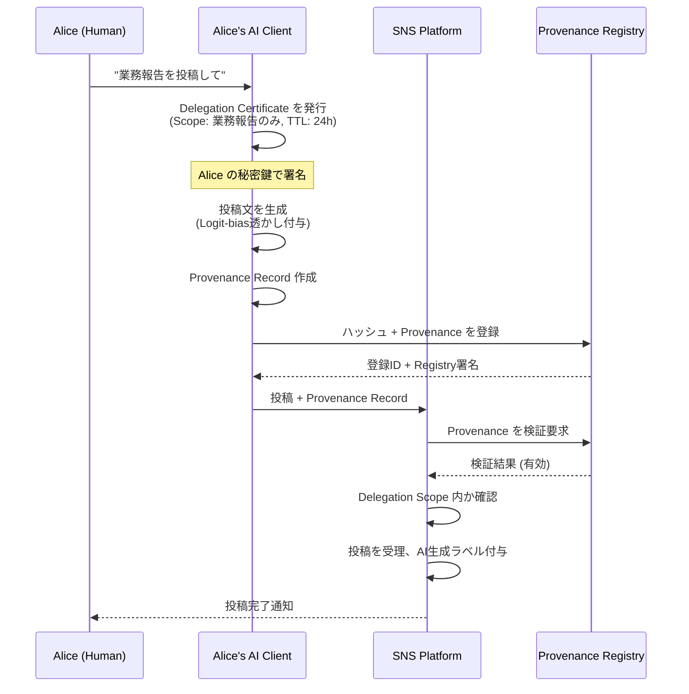
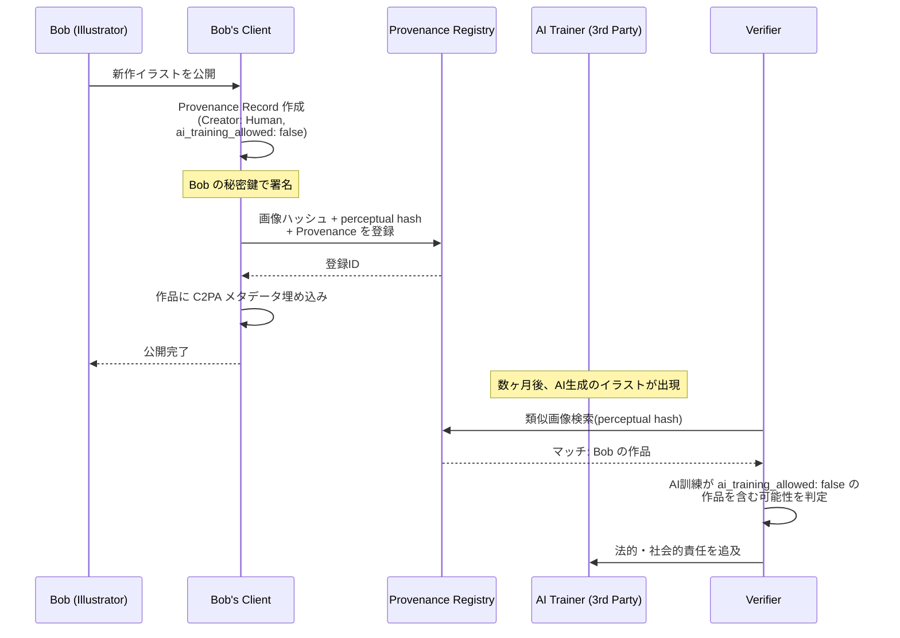
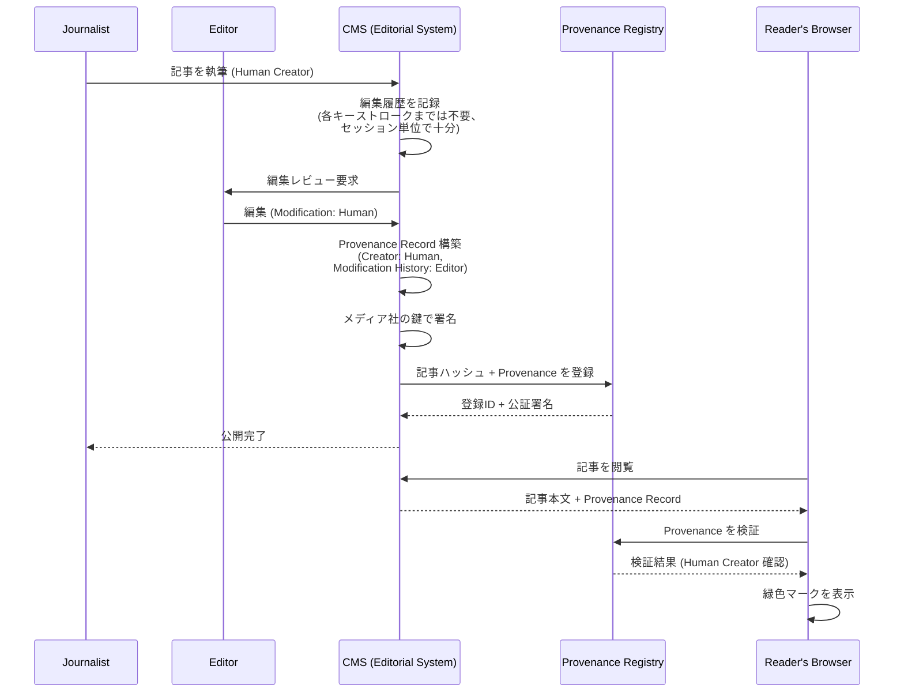
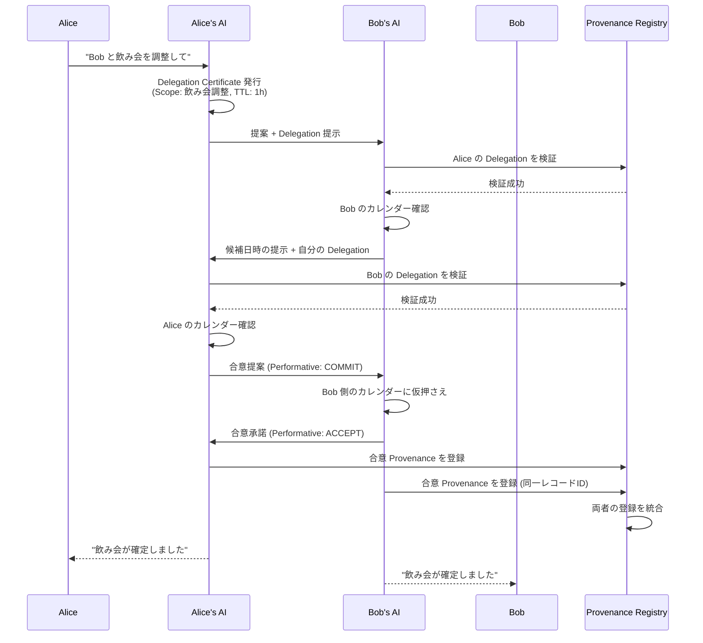
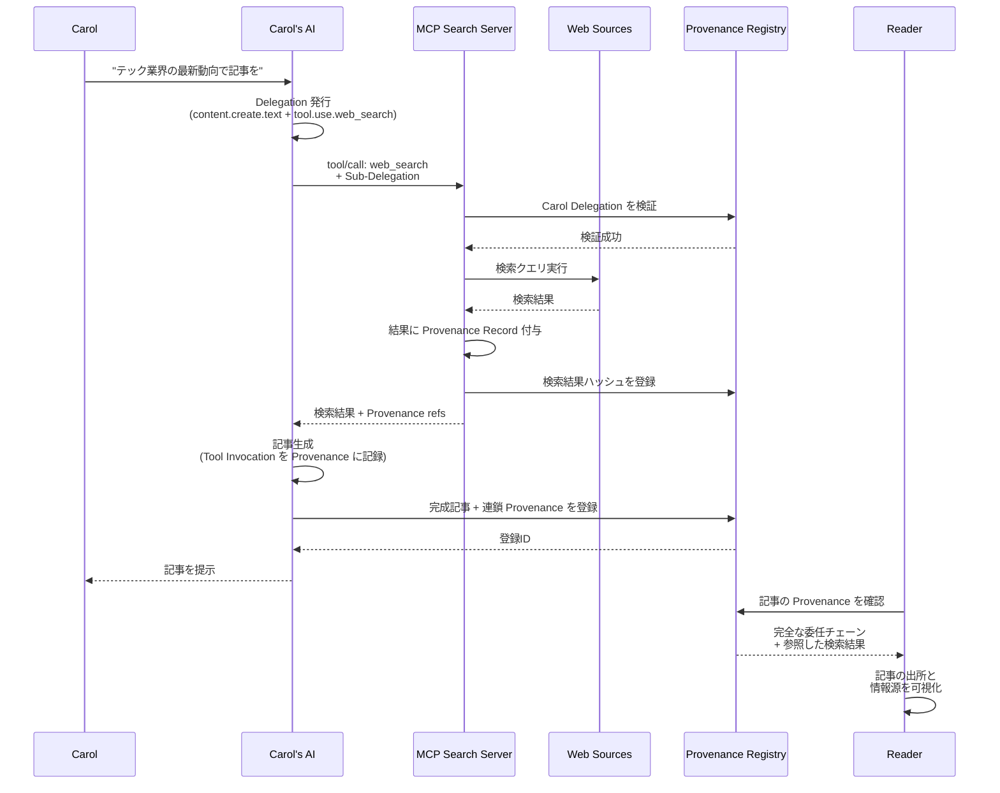

# Content Provenance and Delegation Standard (CPDS)

**叩き台 v0.4**

---

## 概要

CPDS は、コンテンツの出所(誰が・何が作ったか)と、AI が代理生成した場合の委任関係を、検証可能なメタデータとして表現するための規格である。

法的強制ではなく、市場メカニズムによる抑止力で機能することを意図している。「出所をごまかしたコンテンツは価値が下がる」という循環を社会に作ることを目的とする。

C2PA(Coalition for Content Provenance and Authenticity)の概念を継承しつつ、テキストコンテンツへの対応と、AI 委任構造の明示的な表現を追加する。また、MCP(Model Context Protocol)と統合し、AI がツールを使って生成したコンテンツの追跡を可能にする。

---

## ステータス

これは初期ドラフトであり、議論のための叩き台である。仕様として確定したものではない。批判・修正・反論を歓迎する。

---

## 目次

1. はじめに
2. 用語定義
3. アーキテクチャ概観
4. データモデル
5. 署名と検証
6. テキストコンテンツの扱い
7. 出所タイプの分類
8. プラットフォーム統合ガイドライン
9. ユースケース
10. サンプル実装
11. セキュリティ考慮事項
12. プライバシー考慮事項
13. オープン論点
14. 既存規格との関係
15. MCP 統合

---

## 1. はじめに

### 1.1 背景

生成 AI の普及により、コンテンツの出所が不透明になっている。具体的には次の問題が深刻化している。

- 人間のクリエイターの作品が、無断で AI の学習データに使われる
- AI が生成したコンテンツが、人間の作品として流通する
- AI による誹謗中傷・なりすまし・フェイクの発信者が辿れない
- AI が代理で行った行為の責任の所在が曖昧になる

これらは別個の問題に見えるが、根本的には「コンテンツに出所情報が欠落している」という単一の原因に帰着する。

### 1.2 目的

CPDS は以下を達成する。

- すべてのコンテンツに、改ざん不可能な出所メタデータを付与する手段を提供する
- 人間が作ったコンテンツと AI が生成したコンテンツを区別可能にする
- AI が生成した場合、誰の委任で生成されたかを辿れるようにする
- 編集や派生が行われた場合、その履歴を保持する
- これらを通じて、出所をごまかす行為のコストを高め、抑止力を生む

### 1.3 設計原則

**P1: 抑止力志向**
完璧な検出を目指さない。「ごまかすより正直にラベル付けする方が経済的に得」な構造を作る。

**P2: 既存規格の活用**
ゼロから発明せず、C2PA、Verifiable Credentials、DID、OAuth など既存の成熟した規格を組み合わせる。

**P3: 段階的採用**
一部のプラットフォームが先行採用するだけで機能し始める。全員一斉の対応を必要としない。

**P4: 多層防御**
単一の技術に依存しない。透かし、ハッシュ登録、社会的ラベルを組み合わせる。

**P5: クリエイターの主権**
コンテンツの所有者が、自分のコンテンツがどう扱われるかを宣言できる(学習禁止、引用条件など)。

**P6: 法的中立**
本規格は法的強制力を持たない。各国の法制度がどう本規格を活用するかは、規格の外で決まる。

### 1.4 スコープ外

以下は本規格では扱わない。

- 法的罰則の定義
- 強制力の発動条件
- 著作権の譲渡・ライセンスの詳細(別途の権利管理規格と接続する)
- AI モデルの倫理基準
- コンテンツの品質評価

### 1.5 既存規格との関係

CPDS は C2PA の拡張プロファイルとして設計される。C2PA が画像・動画・音声を中心に扱うのに対し、CPDS はテキストへの対応と、AI 委任構造の明示を追加する。

C2PA 既存実装との互換性を保ち、C2PA 対応プラットフォームは追加実装によって CPDS にも対応できる。

加えて、MCP(Model Context Protocol)と統合する。MCP は AI が外部ツールを呼び出すためのプロトコルだが、ツール経由で生成されたコンテンツの出所追跡には対応していない。CPDS は MCP の上に出所と委任のレイヤーを乗せることで、ツール使用を含めた完全な追跡を実現する。詳細はセクション 15 を参照。

---

## 2. 用語定義

| 用語 | 定義 |
|------|------|
| Provenance Record | コンテンツの出所情報を表すデータ構造 |
| Delegation Certificate | AI が誰の委任で動作しているかを証明するデータ構造 |
| Creator | コンテンツの作成主体。Human / AI / Hybrid のいずれか |
| Principal | AI に作業を委任した本人(人間または法人) |
| Agent | 委任を受けて動作する AI |
| Liability Holder | コンテンツに関する最終責任を負う主体 |
| Modification History | コンテンツの編集履歴 |
| Provenance Registry | Provenance Record とハッシュを登録する公的台帳 |
| Tool Invocation | AI が外部ツール(主に MCP サーバー)を呼び出した記録 |
| MCP Server | Model Context Protocol に準拠したツール提供サーバー |
| Sub-delegation | AI が自身に委任された権限の一部を、別の Agent(MCP サーバーなど)に再委任すること |

---

## 3. アーキテクチャ概観

CPDS は次の三層で構成される。

**メタデータ層**: コンテンツに付随する Provenance Record。署名付き JSON-LD として表現される。

**埋め込み層**: メタデータをコンテンツ自体に紐付ける手段。画像・動画は C2PA と同様にファイル内埋め込み。テキストは透かしとハッシュ登録の併用。

**登録層**: コンテンツのハッシュを公的台帳に登録し、改ざん検出と類似性検索を可能にする。

```
[コンテンツ]
    |
    +-- Provenance Record (署名付きメタデータ)
    |     |
    |     +-- Creator情報
    |     +-- Delegation Chain (AIの場合)
    |     +-- Modification History
    |     +-- Liability Holder
    |
    +-- 透かし (テキストの場合)
    |
    +-- ハッシュ登録 (Provenance Registry)
```

---

## 4. データモデル

### 4.1 Provenance Record

```json
{
  "@context": "https://cpds.example.org/v1",
  "type": "ProvenanceRecord",
  "id": "urn:cpds:record:01HQX...",
  "content_hash": "sha256:abc123...",
  "content_similarity_hash": "simhash:def456...",
  "creator": {
    "type": "AI",
    "human_principals": ["did:example:user-alice"],
    "ai_agents": [
      {
        "model": "anthropic/claude-opus-4-7",
        "instance_id": "..."
      }
    ]
  },
  "delegation_chain": [
    {
      "principal": "did:example:user-alice",
      "agent": "did:example:agent-001",
      "agent_type": "ai_model",
      "scope": "text-generation",
      "issued_at": "2026-05-20T10:00:00Z",
      "expires_at": "2026-05-20T11:00:00Z",
      "signature": "..."
    },
    {
      "principal": "did:example:agent-001",
      "agent": "did:example:mcp-server-search",
      "agent_type": "mcp_server",
      "sub_delegation": true,
      "scope": "web-search-readonly",
      "issued_at": "2026-05-20T10:05:00Z",
      "expires_at": "2026-05-20T10:06:00Z",
      "signature": "..."
    }
  ],
  "tool_invocations": [
    {
      "tool_id": "did:example:mcp-server-search",
      "tool_name": "web_search",
      "invoked_at": "2026-05-20T10:05:30Z",
      "input_hash": "sha256:...",
      "output_hash": "sha256:...",
      "output_provenance_refs": ["urn:cpds:record:..."],
      "signature": "..."
    }
  ],
  "created_at": "2026-05-20T10:15:00Z",
  "modification_history": [],
  "liability_holder": "did:example:user-alice",
  "creator_declarations": {
    "ai_training_allowed": false,
    "quotation_terms": "with_attribution",
    "modification_allowed": true
  },
  "signature": {
    "algorithm": "Ed25519",
    "value": "..."
  }
}
```

`delegation_chain` は多段委任を表現できる。User → AI → MCP Server のような連鎖を、各段のスコープと署名とともに記録する。

`tool_invocations` は AI が実際に呼び出したツールの履歴。何を入力して何を得たかをハッシュで記録し、後から検証可能にする。`output_provenance_refs` で、ツールが返したコンテンツ自体の Provenance Record にリンクできる(MCP サーバーが CPDS 準拠の場合)。

### 4.2 Delegation Certificate

AI が単独で動作する場合、Principal からの委任証明書が必要。

```json
{
  "@context": "https://cpds.example.org/v1",
  "type": "DelegationCertificate",
  "id": "urn:cpds:delegation:01HQY...",
  "principal": {
    "did": "did:example:user-alice",
    "public_key": "..."
  },
  "agent": {
    "did": "did:example:agent-001",
    "model": "anthropic/claude-opus-4-7"
  },
  "scope": {
    "actions": ["content.create.text", "content.publish.sns"],
    "constraints": {
      "platforms": ["twitter.com", "mastodon.social"],
      "max_posts_per_day": 10,
      "topics_excluded": ["politics", "finance"]
    }
  },
  "validity": {
    "issued_at": "2026-05-20T00:00:00Z",
    "expires_at": "2026-05-21T00:00:00Z",
    "revocation_endpoint": "https://cpds.example.org/revoke"
  },
  "liability_holder": "did:example:user-alice",
  "signature": {
    "algorithm": "Ed25519",
    "value": "..."
  }
}
```

### 4.3 Modification History

```json
{
  "modifications": [
    {
      "modifier": "did:example:user-bob",
      "modifier_type": "Human",
      "modified_at": "2026-05-20T15:00:00Z",
      "modification_type": "edit",
      "diff_hash": "sha256:...",
      "previous_record": "urn:cpds:record:01HQX...",
      "signature": "..."
    }
  ]
}
```

---

## 5. 署名と検証

### 5.1 識別子

すべてのアクター(人間、AI、組織)は DID(Decentralized Identifier)で識別される。DID は W3C 仕様に準拠する。

人間の DID は、信頼できる発行機関(政府、認証局、プラットフォーム)が発行する。AI の DID は、運用主体が発行する。

### 5.2 署名方式

Ed25519 をデフォルトとする。各 Provenance Record と Delegation Certificate には、発行主体の秘密鍵による署名が必須。

### 5.3 検証手順

1. 署名の検証(改ざんされていないか)
2. 発行主体の DID の有効性確認
3. Delegation Certificate の有効期限と Scope の確認
4. Provenance Registry でのハッシュ照合
5. Modification History の整合性確認

検証は受信側のクライアント(プラットフォーム、ブラウザ拡張、AI エージェント)が行う。

---

## 6. テキストコンテンツの扱い

テキストはファイル形式を持たないため、画像・動画と異なる扱いが必要。多層アプローチを取る。

### 6.1 透かし(Watermarking)

#### 6.1.1 設計目標と制約

理想的なテキスト透かしは以下を満たす。

- **不可視性**: 人間の読者には気付かれない
- **頑健性**: 軽微な編集や再フォーマットで消えない
- **検出可能性**: 適切な鍵を持つ検証者が高精度で検出できる
- **低偽陽性**: 透かしのないテキストを誤検出しない
- **低帯域使用**: テキスト品質を損なわない

これらは完全に両立しないため、トレードオフが必要。CPDS は **頑健性と検出可能性を優先**し、不可視性は妥協する(微細な品質低下は許容)。

#### 6.1.2 採用するアルゴリズム

CPDS は以下の3層の透かしを併用する。

**第1層: Logit-bias 透かし(生成時)**

LLM がトークンを生成する際、語彙を秘密鍵で「グリーンリスト」と「レッドリスト」に分割し、グリーンリストに統計的偏りを持たせる。

参考: Kirchenbauer et al. "A Watermark for Large Language Models" (2023) を基礎とする。

実装:

```
生成時:
  for each token position t:
    1. 前の k トークンと秘密鍵 K からハッシュ h を計算
    2. h を seed として語彙 V を Green(G) / Red(R) に分割
       (例: G = 25%, R = 75%)
    3. G に属するトークンの logit に bias δ を加算
    4. softmax してサンプリング

検出時:
  検証対象テキスト T と秘密鍵 K について:
    1. T の各トークン位置で G/R を再構成
    2. T 内で G トークンが占める比率 p を計算
    3. 帰無仮説「透かしなし」では p ≈ |G|/|V| = 0.25
    4. p が有意に大きければ透かし検出(z 統計量を計算)
```

パラメータ:
- グリーンリスト比率 γ = 0.25(推奨)
- bias δ = 2.0(推奨、強度と品質のバランス)
- コンテキスト窓 k = 1〜4(短いほど頑健、長いほど隠蔽性高)

頑健性: 約 30% 程度のトークン置換まで検出可能。

**第2層: 構文・語彙選好の偏り(生成時)**

第1層に加えて、より粗粒度の選好を埋め込む。秘密鍵から決定される偏好パターンに従って:

- 同義語の選択(例: "important" vs "significant" vs "crucial")
- 構文選択(能動 vs 受動、節の順序)
- 句読点パターン(オックスフォードコンマの有無など)

これは編集に対して第1層より頑健(言い換えで消えにくい)だが、検出感度は低い。第1層と組み合わせて使用。

**第3層: ゼロ幅文字(オプション、補助的)**

特定の位置にゼロ幅スペース(U+200B)、ゼロ幅非接続子(U+200C)などを挿入し、ビット列を埋め込む。

特徴:
- 完全コピーには非常に強い(コピペで残る)
- 「全角空白を半角に統一」のような正規化で消える
- 検出が容易すぎる(攻撃者に気付かれやすい)

CPDS は第3層を**プラットフォーム連携用の補助シグナル**として位置付ける。プラットフォームが第3層を読み取って「これは AI 生成の可能性が高い」と判定する用途。攻撃に対する第一線の防御としては使わない。

#### 6.1.3 透かし鍵管理

透かし鍵は AI モデル提供者ごとに発行され、Provenance Registry に登録される。

```json
{
  "watermark_key_id": "urn:cpds:watermark:anthropic-001",
  "issuer": "did:example:anthropic",
  "algorithm": "logit-bias-v1",
  "parameters": {
    "gamma": 0.25,
    "delta": 2.0,
    "context_window": 4,
    "vocabulary_hash": "sha256:..."
  },
  "key_material": "encrypted-secret-key",
  "verifiers": ["did:example:registry-a", "did:example:registry-b"]
}
```

鍵自体は秘密だが、**検証は Registry に依頼する形**で公開する。検証者は Registry に「このテキストに透かしがあるか」を問い合わせ、Yes/No の結果を得る。鍵そのものは Registry が管理。

これにより、悪意ある検証者が鍵を分析して攻撃手法を編み出すことを防ぐ。

#### 6.1.4 攻撃と対策

| 攻撃 | 効果 | 対策 |
|------|------|------|
| 単純な単語置換 | 第1層を弱める | 第2層、第3層の併用、ハッシュ登録 |
| 完全な言い換え(別 LLM) | 第1〜2層を消す | ハッシュ登録、類似度検索 |
| 文字レベルの編集(改行、空白) | 第3層を破壊 | 第1〜2層は耐性あり |
| 鍵の分析・推測 | 透かしを偽装可能に | 鍵を Registry に隔離、検証 API のみ公開 |
| 透かし偽造 | 別ソースを「透かしあり」と誤認識 | 第1層は鍵なしでは付与不能 |

#### 6.1.5 既知の限界

- 短いテキスト(< 50 トークン)では検出精度が低下
- 翻訳によって透かしは消える
- 人間が大幅に書き直した場合は検出不能
- 高品質を要求する用途では bias δ を下げる必要があり、検出精度が下がる

これらの限界は、ハッシュ登録(6.2)と類似度検索(6.3)で補完する。

### 6.2 ハッシュ登録

#### 6.2.1 登録対象

以下のコンテンツをハッシュ登録する。

- AI 生成された全テキスト(Provenance Registry に必須登録)
- 人間が「保護したい」と明示宣言したテキスト(オプショナル登録)
- 編集・派生コンテンツ(元コンテンツへのリンク付き)

#### 6.2.2 ハッシュアルゴリズム

複数のハッシュを並行登録する。

```json
{
  "exact_hash": "sha256:abc123...",
  "similarity_hashes": {
    "simhash_64": "0xDEADBEEF...",
    "minhash_128": ["hash1", "hash2", ...],
    "semantic_embedding": "sha256-of-embedding-vector"
  },
  "structural_hash": "sha256:hash-of-document-structure"
}
```

| ハッシュ | 用途 | 言い換え耐性 |
|---------|------|------------|
| SHA-256 (exact) | 完全一致検出 | なし |
| SimHash | 文字レベルの軽い変更検出 | 低 |
| MinHash (n-gram) | 部分一致・段落単位検出 | 中 |
| Semantic Embedding Hash | 意味レベル類似 | 高 |
| Structural Hash | 文書構造(見出し、段落配置) | 中 |

#### 6.2.3 登録プロトコル

**Register API**

```http
POST /api/v1/registry/register
Content-Type: application/json
Authorization: DID-Auth ...

{
  "provenance_record": {...},
  "hashes": {...},
  "watermark_token": "...",
  "registration_options": {
    "ttl": "permanent",
    "visibility": "public",
    "registry_replication": ["registry-a", "registry-b"]
  }
}
```

レスポンス:

```json
{
  "registration_id": "urn:cpds:reg:01HQZ...",
  "registered_at": "2026-05-20T10:15:00Z",
  "registry_signatures": [
    {"registry": "registry-a", "signature": "..."},
    {"registry": "registry-b", "signature": "..."}
  ],
  "expires_at": null
}
```

複数 Registry に複製登録することで、単一 Registry の障害や検閲に耐性を持たせる。

**Query API**

```http
GET /api/v1/registry/query?hash={hash}&type={exact|similarity}&threshold={0.0-1.0}
```

レスポンス:

```json
{
  "matches": [
    {
      "registration_id": "urn:cpds:reg:01HQZ...",
      "match_type": "exact",
      "similarity_score": 1.0,
      "registered_at": "2026-05-20T10:15:00Z",
      "provenance_record_url": "..."
    }
  ]
}
```

#### 6.2.4 Registry 間の同期プロトコル

複数の Registry が独立して運営されつつ、相互にデータを同期する。

**プッシュベース同期**: 新規登録があった Registry は、フェデレーションパートナーに非同期で通知。

**プルベース同期**: 各 Registry は定期的に他 Registry の更新を取得。

**コンフリクト解決**: 同一コンテンツが複数 Registry に異なる Provenance Record で登録された場合、タイムスタンプ優先(早い者勝ち)で正規化。ただし元の記録は両方保持し、不一致を監査ログに残す。

**通信プロトコル**: ActivityPub プロトコル(Mastodon などで使用)を参考にした非中央集権型同期。各 Registry が独立した「インスタンス」として動作。

#### 6.2.5 スケーラビリティ

世界中の AI 生成コンテンツを全て登録すると、容量が爆発する。対策:

- **シャーディング**: ハッシュの先頭ビットで Registry をシャード化
- **アーカイブ層**: 古いレコードは高速ストレージから低速ストレージへ
- **集約**: 同一ソースから大量生成されたコンテンツは、メタデータレベルで集約
- **エッジキャッシュ**: 頻繁にクエリされるレコードを CDN にキャッシュ

予想ロード: AI が日次 10^12 トークン生成し、平均 100 トークン/レコードと仮定すると、日次 10^10 レコード。年間 10^12.5 レコード。これは大規模だが、現在のクラウドインフラで対応可能なオーダー。

### 6.3 類似度検出

#### 6.3.1 多段検索戦略

新規コンテンツが登録される際、または検証要求があった際、以下の順で類似コンテンツを検索する。

```
1. Exact hash (SHA-256) で完全一致を検索 - O(1)
   ↓ ヒットなし
2. SimHash (Hamming 距離 ≤ 3) で近似一致 - O(log N)
   ↓ ヒットなし
3. MinHash + LSH で n-gram 類似を検索 - O(log N)
   ↓ ヒットなし
4. Semantic embedding 類似検索 - O(log N) with ANN index
   ↓ ヒットなし
5. 「新規」として登録
```

#### 6.3.2 閾値設定

類似と判定する閾値は、コンテンツ種別ごとに調整する。

| コンテンツ種別 | SimHash | MinHash Jaccard | Semantic Similarity |
|------------|---------|-----------------|---------------------|
| 詩、短歌 | ≤ 5 bits | ≥ 0.6 | ≥ 0.85 |
| 散文・記事 | ≤ 10 bits | ≥ 0.5 | ≥ 0.80 |
| 技術文書 | ≤ 15 bits | ≥ 0.4 | ≥ 0.75 |
| コード | ≤ 8 bits | ≥ 0.55 | ≥ 0.80 |

種別の判定はメタデータか、コンテンツの自動分類器で行う。

#### 6.3.3 誤検出と漏検出

完璧な類似度検出は不可能。CPDS は以下のスタンスを取る。

- **誤検出(False Positive)**: 偶然似たコンテンツが「派生」と誤判定される。対策として、人手による異議申立てプロセスを各 Registry に必須化。
- **漏検出(False Negative)**: 巧妙に編集された派生コンテンツが「新規」と誤判定される。対策として、Semantic Embedding を強化、新しい埋め込みモデルへの定期的アップデート。

両者のバランスは閾値で調整する。デフォルトは漏検出寄り(過剰検出を避ける)。

#### 6.3.4 ユースケースごとの利用

- **クリエイター保護**: 自分の作品が無断 AI 学習・盗作されていないか、定期スキャン
- **プラットフォーム**: 投稿時に類似コンテンツの存在をユーザーに通知
- **AI モデル評価**: 学習データの「reciting」(オリジナルの逐語再生)を検出
- **ジャーナリズム**: フェイクニュースが既存コンテンツの改変かを判定

---

## 7. 出所タイプの分類

### 7.1 Human

人間が単独で作成したコンテンツ。AI の補助を一切受けていない。

宣言の正確性は本人の自己申告に依存する。虚偽宣言が発覚した場合のレピュテーション損失が抑止力となる。

### 7.2 AI

AI が単独で生成したコンテンツ。Delegation Certificate が必須。

人間の Principal が存在し、その人間が Liability Holder となる。

### 7.3 Hybrid

人間と AI が協働したコンテンツ。寄与の度合いはオプションで記録できるが、必須ではない。

Liability Holder は、最終的にコンテンツを公開した人間とする(本規格の前提)。

---

## 8. プラットフォーム統合ガイドライン

### 8.1 表示

プラットフォームは Provenance Record を読み取り、ユーザーに視覚的に提示することが推奨される。

推奨される視覚指標:

- 緑: Human、検証済み
- 青: AI、適切な Delegation あり、Liability 明示
- 黄: Hybrid、または部分的に情報が欠落
- 灰: Provenance Record なし(出所不明)
- 赤: 改ざん検出、または Delegation 不正

### 8.2 UI

メタデータへのアクセスは、コンテンツの近くにアイコン(例: 認証マーク)を配置し、クリックで詳細を表示する形式を推奨する。

ユーザー教育のため、初回利用時に「このマークの意味」を説明する仕組みを設けることが望ましい。

---

## 9. ユースケース

各ユースケースについて、Mermaid シーケンス図と詳細フローを示す。実装者は本セクションを参照して各エンドポイントを実装する。

### 9.1 AI による代筆 SNS 投稿

**シナリオ**: ユーザー Alice が AI に「自分のアカウントで業務報告を投稿しといて」と依頼する。

**シーケンス図**:



**詳細フロー**:

1. **委任の発行**
   - Alice's AI Client が `DelegationCertificate` を生成
   - `scope.actions = ["content.create.text", "content.publish.sns"]`
   - `scope.constraints.topics = ["work_report"]`
   - `scope.constraints.platforms = ["twitter.com"]`
   - `validity.expires_at = now + 24h`
   - Alice の秘密鍵で署名

2. **コンテンツ生成**
   - AI が業務報告文を生成
   - 生成時に Logit-bias 透かしを付与(セクション 6.1.2 第1層)
   - `ProvenanceRecord` を作成:
     - `creator.type = "AI"`
     - `creator.human_principals = ["did:example:alice"]`
     - `delegation_chain = [上記の DelegationCertificate]`
     - `liability_holder = "did:example:alice"`

3. **Registry 登録**
   - `POST /api/v1/registry/register` でハッシュと Provenance を登録
   - Registry が登録 ID と署名を返す
   - 失敗した場合は再試行(最大3回、指数バックオフ)

4. **SNS への投稿**
   - 投稿 API リクエストに Provenance Record を添付(`_cpds` フィールド)
   - SNS プラットフォームが Provenance を Registry で検証
   - Scope が `content.publish.sns` を許可しているか確認
   - プラットフォームのドメインが `constraints.platforms` に含まれるか確認

5. **表示**
   - 投稿には青色の認証マーク(AI生成、Alice責任)が表示
   - クリックで Delegation Chain と Provenance の詳細を表示

**責任の所在**: 投稿内容に問題があれば、`liability_holder = Alice` として記録されている。Alice は「AI が勝手にやった」と主張できない(委任証明書の存在が逆証となる)。

---

### 9.2 イラストレーターの作品保護

**シナリオ**: イラストレーター Bob が新作を公開し、AI による無断学習・盗用から保護する。

**シーケンス図**:



**詳細フロー**:

1. **作品の保護宣言**
   - Bob のクライアントで `ProvenanceRecord` を作成
   - `creator.type = "Human"`
   - `creator_declarations.ai_training_allowed = false`
   - `creator_declarations.quotation_terms = "with_attribution"`
   - `creator_declarations.modification_allowed = false`

2. **複数のハッシュを登録**
   - SHA-256(完全一致用)
   - Perceptual Hash(画像の見た目の類似性、pHash)
   - 知覚的な特徴量(Vision Transformer 埋め込み)
   - これらすべてを Registry に登録

3. **C2PA メタデータの埋め込み**
   - 作品ファイル(JPEG/PNG)に C2PA マニフェストを埋め込み
   - 作品が SNS で拡散しても、メタデータが残る

4. **継続的監視**
   - Bob は定期的に Registry の類似コンテンツ検索を実行
   - または、Registry が自動アラート機能を提供
   - 類似作品が発見されたら、Bob に通知

5. **発見時の対応**
   - 類似作品の Provenance Record を確認
   - AI 生成だった場合、生成元の AI 提供者を特定
   - `ai_training_allowed: false` の作品が学習データに含まれた可能性を主張
   - 法的措置、または社会的告発

**抑止効果**: AI 提供者は、学習データに `ai_training_allowed: false` の作品が含まれていないことを示せないと、評判リスクを負う。これにより、学習データの選別が事前に行われる経済的圧力が生まれる。

---

### 9.3 ニュース記事の出所証明

**シナリオ**: ニュースメディアが記事を公開し、AI 生成のフェイク記事と差別化する。

**シーケンス図**:



**詳細フロー**:

1. **執筆と編集の追跡**
   - 記者がエディタで執筆。エディタは編集セッションを記録
   - 各セッションごとにスナップショットを取り、ハッシュを残す
   - 完成した記事に対し、複数の Human 寄与者(記者、編集者)を `Modification History` として記録

2. **メディア社による公証**
   - メディア社の組織 DID と公開鍵で記事に署名
   - 単なる個人署名でなく、組織としての保証
   - メディア社が信頼できる発行者(認証された Trust Anchor)であることが、価値を生む

3. **Registry での公証**
   - 主要ニュース向け Registry(例: News Provenance Registry)に登録
   - 複数の独立 Registry に複製(検閲耐性)

4. **読者の体験**
   - 読者のブラウザ(または専用拡張)が、記事の Provenance を自動検証
   - 緑色マーク(Human Creator、認証済みメディア)を表示
   - クリックすると、執筆者、編集履歴、公証情報が見える

5. **AI 生成フェイクとの差別化**
   - フェイクニュースサイトが同じスタイルで記事を出しても、Provenance が無い
   - SNS でシェアされる際、「Provenance なし」のマークがつく
   - 読者は信頼性の差を視覚的に認識

**応用**: 同じ仕組みを学術論文、政府公文書、企業のプレスリリースなどに展開可能。

---

### 9.4 AI 同士の交渉

**シナリオ**: Alice の AI と Bob の AI が、人間を介さずに飲み会の調整を行う。

**シーケンス図**:



**詳細フロー**:

1. **委任の確立**
   - Alice の AI が「飲み会調整」用の Delegation を発行
   - Bob の AI も同様(事前に Bob から包括的な日程調整委任を受けている)
   - 両者の Delegation Certificate を相互に検証

2. **構造化された交渉**
   - メッセージは Speech Act Protocol(将来追加予定)に基づく構造化形式
   - PROPOSE → COUNTER-PROPOSE → ACCEPT/REJECT/COMMIT
   - 各メッセージは送信者の AI 鍵で署名
   - 人間語の自然言語表現はオプション

3. **合意の確定**
   - 両者が COMMIT/ACCEPT の対で合意したとき、確定
   - 合意内容は両者の Provenance Registry に同期登録
   - 登録レコードには「両者の署名」が含まれる(マルチシグ)

4. **証拠としての保存**
   - 後日「そんな約束していない」となった場合、Registry に登録された合意レコードが証拠
   - 改ざん不可、双方の署名あり、タイムスタンプ付き
   - 法的紛争でも証拠能力を持ち得る

5. **失敗時の処理**
   - 一方が COMMIT した後、相手が応答しない場合、TTL 経過で自動キャンセル
   - キャンセル自体も Registry に記録(「合意失敗」のレコード)

**意義**: 「言った言わない」の解消、AI 媒介でも責任が明確、人間が確認不要な合意レベルの拡大。

---

### 9.5 MCP ツールを使った記事生成

**シナリオ**: ユーザー Carol が AI に記事執筆を依頼し、AI が MCP 経由で Web 検索を使う。

**シーケンス図**:



**詳細フロー**:

1. **依頼受領**
   - Carol が AI に依頼
   - AI は「記事生成」と「Web 検索」を含むスコープで Delegation 発行
   - 例: `scope.actions = ["content.create.text", "tool.use.web_search"]`

2. **MCP サーバーへのサブ委任**
   - AI が `web_search` ツールを呼び出す
   - サブ委任証明書を発行:
     - `principal = AI's DID`
     - `agent = MCP Search Server's DID`
     - `scope.actions = ["web_search.query"]`(元の権限の部分集合)
     - `validity.expires_at = now + 60秒`(短寿命)
   - リクエストに `_cpds.principal_delegation` と `_cpds.sub_delegation` を含める

3. **MCP サーバーの検証と実行**
   - サーバーが両方の Delegation を検証
   - Sub-Delegation のスコープが Principal Delegation の部分集合か確認
   - 検証成功なら、Web 検索を実行
   - 結果に Provenance Record を付与して返す:
     - `creator.type = "AI"` (Search Server)
     - `source_urls = [検索元URL]`
     - 結果のハッシュを Registry に登録

4. **AI による記事生成**
   - 検索結果を元に記事を生成
   - 生成記事の `ProvenanceRecord` に `tool_invocations` を記録
   - 各 Tool Invocation には:
     - 使用ツールの DID
     - 入力ハッシュ、出力ハッシュ
     - 出力の Provenance Record への参照
   - 連鎖が完成: User → AI → Search Tool → Web Sources

5. **読者の体験**
   - 読者は記事の Provenance を見て、AI 生成と確認
   - さらに掘ると、参照された検索結果が見える
   - さらに掘ると、検索結果の元 Web サイトが見える
   - 「この AI 生成記事は、これらの一次情報を参照している」が透明

6. **誤情報の責任切り分け**
   - 仮に記事に虚偽が含まれていた場合:
     - **A**: AI が検索結果を捏造 → AI 提供者の責任
     - **B**: 検索結果自体が虚偽 → Web サイトの責任
     - **C**: AI が結果を誤解釈 → AI 提供者の責任(部分的)
   - Provenance Chain により、責任の所在を技術的に切り分けられる

**意義**: AI が「もっともらしい嘘」を生成する問題に対し、出所追跡で対応する。フェイクニュースが大量生成される未来でも、各情報の源流を辿れる。

---

---

## 10. サンプル実装

リファレンス実装は別リポジトリで提供する予定(本ドラフトの段階では未着手)。

最小構成は以下を想定する。

- Provenance Record の生成・署名ライブラリ(Python / Rust)
- Delegation Certificate の発行・検証ライブラリ
- ローカル Provenance Registry サーバー(検証用)
- ブラウザ拡張機能(コンテンツの Provenance を表示)

---

## 11. セキュリティ考慮事項

**鍵管理**: Principal の秘密鍵が漏洩すると、なりすましが可能になる。ハードウェアキー(YubiKey 等)の使用を推奨する。

**Registry の信頼性**: Provenance Registry が単一機関に集中すると、検閲のリスクがある。複数機関の分散運用が必須。

**Delegation の悪用**: AI に過剰に広い Scope を与えると、本人の意図しない行為が「正当な委任」として実行される。Scope は最小権限の原則で設計する。

**透かしの除去攻撃**: 統計的透かしは、十分に編集されると失われる。完全な防御は不可能であり、ハッシュ登録との併用が必須。

---

## 12. プライバシー考慮事項

すべての行為に DID が紐付くことは、追跡可能性を高める一方、プライバシーリスクでもある。

以下の選択肢を提供する。

**仮名 DID**: 実名と紐付かない DID を使用できる。後から実名と接続する必要が生じた場合のみ、信頼できる第三者が紐付けを開示する(エスクロー方式)。

**Zero-Knowledge Proof**: 「正当な委任が存在する」事実だけを証明し、Principal の身元は秘匿する選択肢。

**選択的開示**: Provenance Record の一部だけを公開し、残りは要請があった場合に開示する。

匿名性と説明責任のバランスは、用途ごとに調整可能とする。

---

## 13. オープン論点

以下は本ドラフトでは結論を出していない、議論が必要な論点。

**Q1**: テキスト透かしの具体的アルゴリズム。複数候補のうちどれを標準とするか。

**Q2**: Provenance Registry の運営主体。政府か、業界団体か、分散型(ブロックチェーン)か。

**Q3**: Creator: Human の自己申告をどこまで信頼するか。虚偽申告を検出する手段は必要か。

**Q4**: Hybrid における寄与度の表現。詳細に記録すべきか、最小限にとどめるか。

**Q5**: 既存コンテンツ(本規格制定前のもの)の扱い。遡及的に Provenance を付与する仕組みは作るか。

**Q6**: AI による派生・引用の扱い。学習結果に元データの Provenance はどう反映されるか。

**Q7**: 国際的な相互運用性。各国の DID 発行機関をどう接続するか。

**Q8**: MCP サーバーの認証機関を誰が運営するか。MCP 自体のエコシステムガバナンスとの関係。

**Q9**: サブ委任の連鎖深度に制限を設けるか。理論上は無限に連鎖可能だが、追跡コストが増大する。

---

## 14. 既存規格との関係

| 規格 | 関係 |
|------|------|
| C2PA | 本規格の基盤。画像・動画の取り扱いは C2PA をそのまま使用 |
| W3C Verifiable Credentials | Delegation Certificate の表現に使用 |
| W3C DID | アクターの識別子として使用 |
| OAuth 2.0 | Delegation の発行フローを参考にする |
| JSON-LD | Provenance Record のフォーマット |
| MCP (Model Context Protocol) | AI のツール呼び出しを CPDS の委任チェーンに統合(セクション 15) |
| EU AI Act | 本規格は AI Act の透明性要件の実装手段になり得る |
| 各国著作権法 | 本規格は著作権を再定義しないが、運用面で著作権主張の根拠となる |

---

## 15. MCP 統合

### 15.1 統合の動機

MCP(Model Context Protocol)は AI が外部ツールや外部データソースを呼び出すための規格である。広く採用が進んでいるが、以下の課題がある。

- ツール経由で生成されたコンテンツの出所追跡ができない
- AI がツールに対してどの権限を持っているか明示的でない
- ツールが返したデータの信頼性を検証する仕組みがない
- ツールの責任の所在が不明確

CPDS はこれらの課題に出所と委任のレイヤーを提供する。MCP のシンプルさを損なわず、必要な場面でだけ CPDS のメタデータを付加する設計とする。

### 15.2 MCP サーバーの位置付け

CPDS の観点では、MCP サーバーは「Agent」の一種として扱われる。具体的には、

- 各 MCP サーバーは DID を持つ
- MCP サーバーは Sub-Agent として委任チェーンに組み込まれる
- AI が MCP サーバーを呼ぶことは、AI から MCP サーバーへの権限のサブ委任と見なされる

これにより、ユーザー → AI → MCP サーバー → コンテンツ、という連鎖を完全に追跡できる。

### 15.3 委任のサブ委任

AI が MCP サーバーを呼び出す際、AI は自身に委任された権限の一部を MCP サーバーにサブ委任する。サブ委任の範囲は元の委任の範囲を超えてはならない(最小権限の原則)。

```
User Delegation (User → AI)
  scope: [content.create.text, tool.use.web_search]
  ↓
  Sub-Delegation (AI → MCP Server)
    scope: [web_search.query]  ← 元の権限の部分集合
```

サブ委任証明書は、AI が動的に発行する。AI は自身の秘密鍵で署名し、その AI に対する Principal の委任証明書とともに、MCP サーバーに提示する。

MCP サーバーは、両方の証明書を検証してから動作する。

### 15.4 CPDS 準拠 MCP サーバーの要件

MCP サーバーが CPDS 準拠を宣言する場合、以下を満たす。

**必須要件**

- 自身の DID と公開鍵を公開すること
- サブ委任証明書を検証してから動作すること
- 自身の出力に署名すること
- 出力のハッシュを Provenance Registry に登録できること
- 出力に CPDS Provenance Record を付与すること

**推奨要件**

- 自身の動作ログを監査可能な形で保持すること
- 出力の信頼性指標(データソース、最終更新日時など)を提供すること
- 入力データの Provenance Record を確認し、信頼できないソースを拒否できること

### 15.5 MCP プロトコル拡張

MCP の既存メッセージに、CPDS フィールドをオプションで追加する。

#### Tool Discovery 時の能力宣言

MCP サーバーは `initialize` レスポンスに CPDS 対応情報を含める。

```json
{
  "capabilities": {
    "tools": {...},
    "cpds": {
      "version": "0.2",
      "compliance_level": "full",
      "did": "did:example:mcp-server-search",
      "public_key": "...",
      "provenance_registry": "https://registry.example.org"
    }
  }
}
```

#### Tool Call 時の委任証明書

AI が MCP サーバーを呼び出す際、リクエストに委任証明書を含める。

```json
{
  "method": "tools/call",
  "params": {
    "name": "web_search",
    "arguments": {"query": "..."},
    "_cpds": {
      "principal_delegation": {...},
      "sub_delegation": {...}
    }
  }
}
```

#### Tool Response 時の Provenance

MCP サーバーは応答に Provenance Record を含める。

```json
{
  "result": {
    "content": [...],
    "_cpds": {
      "provenance_record": {...},
      "source_provenance_refs": ["urn:cpds:record:..."]
    }
  }
}
```

`_cpds` プレフィックスを使うことで、CPDS 非対応のクライアント・サーバーは無視できる。後方互換性が保たれる。

### 15.6 MCP リソースの Provenance

MCP は「Resources」として外部データを提供する仕組みを持つ。CPDS 準拠の MCP サーバーが提供するリソースには、Provenance Record が付与される。

これにより、AI が外部データを参照した際、そのデータの出所が辿れる。「この AI 生成記事は、A 社のデータベースを参照している」「そのデータは B 大学の研究に基づく」のような連鎖が透明化される。

### 15.7 CPDS 機能を MCP で提供する

逆方向の統合として、CPDS の機能自体を MCP サーバーとして提供することもできる。これにより、任意の AI クライアントが CPDS のサービスを使えるようになる。

提供される MCP ツールの例:

- `cpds.register_content`: コンテンツを Provenance Registry に登録
- `cpds.verify_content`: コンテンツの出所を検証
- `cpds.issue_delegation`: 委任証明書を発行
- `cpds.revoke_delegation`: 委任を取り消し
- `cpds.query_provenance`: 出所情報を問い合わせ
- `cpds.check_similarity`: 類似コンテンツを検索

これらが MCP サーバーとして公開されれば、Anthropic Claude、OpenAI、Google Gemini、その他あらゆる MCP 対応 AI が CPDS を使える。MCP の普及度と CPDS の普及度が相互に高め合う構造になる。

### 15.8 MCP 経由のなりすまし対策

MCP の現状の課題として、「悪意ある MCP サーバー」のリスクがある。AI が信頼できないサーバーに接続して、不正な情報を取得・送信する可能性がある。

CPDS の DID と署名の仕組みは、この対策にもなる。

- MCP サーバーの DID と公開鍵を、信頼できる第三者(MCP Registry など)が認証する
- AI は接続前に DID を検証し、未認証のサーバーには警告を出す
- ユーザーは「認証済み MCP サーバー」だけを使う設定にできる

この仕組みは MCP 自体に組み込まれてもよいし、CPDS の拡張として提供してもよい。

### 15.9 移行戦略

既存の MCP エコシステムへの影響を最小化する。

- CPDS 対応は完全にオプトイン。非対応サーバーも引き続き動作する
- AI クライアント側で「CPDS 対応サーバーを優先する」設定を提供
- CPDS 対応の証明として、MCP サーバーのリストに「CPDS 認証マーク」を表示
- 段階的に、機微なドメイン(金融、医療、法務)から CPDS 対応を義務化する流れを想定

### 15.10 サブ委任のセキュリティ考慮

サブ委任は強力な仕組みだが、新たな攻撃面も生む。以下の脅威モデルと対策を定める。

#### 15.10.1 想定される攻撃

**T1: スコープ拡張攻撃**

悪意ある AI(または侵害された AI)が、元の委任スコープを超えるサブ委任証明書を発行する。例: ユーザーから「テキスト生成」のみを委任された AI が、MCP サーバーに「メール送信」のサブ委任を発行する。

**T2: 古い証明書の再利用(リプレイ攻撃)**

過去に発行されたサブ委任証明書を、無効化された後も使い回す。

**T3: AI 秘密鍵の侵害**

AI の秘密鍵が漏洩した場合、攻撃者は任意のサブ委任証明書を発行できる。元のユーザー委任の範囲内であれば、検証側からは正当に見える。

**T4: MCP サーバーのなりすまし**

正規の MCP サーバーの DID を詐称する。AI は偽サーバーに機密情報を渡す可能性。

**T5: クロスサーバー結託**

複数の悪意ある MCP サーバーが結託し、コンテンツのロンダリングを行う。出所情報を段階的に書き換えて、最終的に正当な出所を装う。

**T6: 連鎖深度攻撃**

サブ委任を意図的に深く連鎖させ、検証コストを増大させる(DoS)。

**T7: Time-of-Check vs Time-of-Use**

サブ委任証明書が検証時点では有効だが、実際の処理時点では取り消されている。

**T8: Confused Deputy 問題**

MCP サーバーが、自身に対する正当な委任を悪用して、別のユーザーのリソースにアクセスする。

#### 15.10.2 対策

**D1: スコープ部分集合性の数学的検証**

サブ委任のスコープは、親委任のスコープの真部分集合でなければならない。これを単純な文字列マッチではなく、形式的なポリシー言語(XACML、Rego など)で表現し、機械的に検証する。

実装例:
```
親スコープ: {actions: ["content.create.*"], constraints: {topics: ["tech"]}}
子スコープ: {actions: ["content.create.text"], constraints: {topics: ["tech"]}}
↑ これは合法(真部分集合)

親スコープ: {actions: ["content.create.text"]}
子スコープ: {actions: ["content.create.image"]}
↑ これは違法(部分集合ではない)
```

**D2: 短寿命サブ委任 + Nonce**

サブ委任証明書の有効期限はデフォルトで60秒以内。各証明書は一意の Nonce を含み、Provenance Registry に発行時点で記録される。同じ Nonce での再利用は拒否される。

**D3: 鍵管理の階層化**

AI の長期秘密鍵は HSM(Hardware Security Module)に格納し、サブ委任発行用の短期鍵を派生させて使用する。長期鍵が直接漏洩するリスクを最小化する。

機微な操作(金融、医療など)では、サブ委任発行ごとに本人(Principal)のリアルタイム承認を必須とする。これにより、AI 鍵が侵害されても被害を限定できる。

**D4: MCP サーバー DID の厳格な検証**

AI クライアントは MCP サーバーに接続する前に、DID を MCP Registry(セクション 15.11)で検証する。検証時には:

- 公開鍵の一致
- 失効リストへの未登録
- 発行者(Trust Anchor)の信頼性
- 通信路の TLS 証明書との一致(チャネルバインディング)

を確認する。一つでも欠ければ警告を出し、ユーザーの明示承認なしには接続しない。

**D5: クロスサーバー結託への対策**

すべての Provenance Record は不可逆的に Registry に記録される。後からの書き換えは検出可能。複数サーバーが結託しても、改ざんの痕跡は残る。

加えて、Provenance Record には「直前の入力データの Provenance」へのリンクが必須とする。これにより、「どこから始まったコンテンツか」を辿れる。中間ノードでの偽装は連鎖の整合性検証で検出される。

**D6: 連鎖深度の制限**

サブ委任の連鎖深度は標準で最大 5 段までとする。これを超える場合は明示的にユーザーが承認する。実用上、5 段あれば十分(User → AI → MCP Tool → Sub-tool → Sub-sub-tool)。

検証側はこの深度制限を強制し、超過した連鎖は拒否する。

**D7: オンライン取消確認**

機微な操作のサブ委任は、使用時点で Registry にオンライン照会して有効性を確認する。OCSP(Online Certificate Status Protocol)の AI 委任版を用意する。

照会の頻度は機微度に応じて調整可能。低リスク操作はキャッシュ可、高リスク操作は毎回照会。

**D8: 委任の使用主体の固定**

サブ委任証明書には、「この委任を使用してよい Principal」を明示的に記録する。Confused Deputy を防ぐため、委任は発行された Principal-Agent ペアの文脈でのみ有効。

#### 15.10.3 セキュリティレベル

実装は以下のセキュリティレベルを宣言する。利用者はレベルに応じて使い分ける。

| レベル | 鍵管理 | 取消確認 | 連鎖深度 | 用途 |
|--------|--------|----------|---------|------|
| Basic | ソフトウェア鍵 | キャッシュ可 | 5 | SNS投稿、雑談 |
| Standard | TEE | 5分以内のキャッシュ | 3 | 業務文書、調整 |
| High | HSM必須 | 毎回オンライン | 2 | 金融、医療、法務 |
| Critical | HSM + 二要素 | 毎回 + 本人即時承認 | 1 | 大口取引、重要法的判断 |

### 15.11 MCP Registry のガバナンス

MCP Registry は、MCP サーバーの DID と公開鍵を認証し、利用者が信頼性を判断できるようにする中核インフラ。誰が運営するかが最も難しい論点の一つ。

#### 15.11.1 単一運営の問題

「一つの組織が全てを認証する」モデルには深刻な問題がある。

- 単一障害点(技術的・政治的)
- 検閲リスク(運営者が特定サーバーを排除する権限を持つ)
- 国家主権の問題(他国の組織を信頼するか)
- 公平性の問題(運営者自身が MCP サーバーを提供する場合の利益相反)

過去の歴史(認証局の集中問題、ドメイン管理の地政学的緊張)から学ぶと、単一運営は避けるべき。

#### 15.11.2 フェデレーション型モデル

提案するモデルは、複数の Registry が相互運用する**フェデレーション**。

```
[Industry Consortium Registry]  [Government Registry (各国)]
        ↑                              ↑
        └──── Cross-Registry Protocol ────┘
                       ↑
        [Community Registry]    [Specialized Registry (医療など)]
```

各 Registry は独立に運営される。それぞれが独自の信頼基準を持つ。相互運用プロトコルにより、ある Registry で認証された MCP サーバーは、他の Registry からも参照可能。

利用者(AI クライアント)は、信頼する Registry のリストを保持する。複数の Registry で認証されている MCP サーバーは、信頼度が高いと評価される。

#### 15.11.3 Trust Anchor の階層

各 Registry には Trust Anchor がある。Trust Anchor は、Registry の運営主体そのもの。利用者は Trust Anchor の公開鍵を、安全な経路(OS、ブラウザ、AI クライアントへのプリインストール)で取得する。

これは現在の Web PKI(SSL/TLS 証明書システム)と同じ構造。Web PKI の問題点(認証局の信頼問題)から学んで、以下の改善を導入する。

- **証明書透明性ログ(Certificate Transparency)**: すべての発行履歴を公開ログに記録。不正発行を検出可能。
- **Pinning**: 重要な MCP サーバーは公開鍵をクライアント側に直接記録(Trust Anchor を経由しない)。
- **Multi-signature**: 高信頼レベルの認証は複数 Trust Anchor の署名を要求。

#### 15.11.4 認証基準

各 Registry は以下の基準を最低限満たすべき。

**技術基準**:
- DID と公開鍵の一意性確認
- MCP プロトコル仕様への準拠テスト
- セキュリティ実装の検査(鍵管理、TLS、入力検証など)
- ログ保持と監査受け入れ義務

**運営基準**:
- 運営主体の身元確認(法人登録、責任者の明示)
- 利用規約とプライバシーポリシーの公開
- インシデント時の連絡体制
- 廃止時の利用者通知義務

**手続き基準**:
- 公開された審査プロセス
- 異議申立て手続き
- 失効と再認証のルール

#### 15.11.5 ガバナンス構造

各 Registry の運営は、以下の原則に従う。

**多様な利害関係者の参加**: 運営委員会には、MCP サーバー提供者、AI クライアント提供者、エンドユーザー代表、技術専門家、市民社会代表を含める。一部の利害関係者が支配しない構造とする。

**透明性**: 運営の意思決定、認証基準、ログ、財務状況は原則公開。

**説明責任**: 認証取消などの重要決定は、理由を文書化して当事者に通知。異議申立てに応じる義務。

**独立性**: 運営主体は、認証対象の MCP サーバー提供者から独立。資金源も特定企業に依存しない。

**国際協調**: 各国の Registry は、相互認証協定を結ぶ。同時に、各国の主権と法制度を尊重。

#### 15.11.6 経済モデル

Registry の運営には資金が必要。以下の組み合わせを想定。

- MCP サーバー提供者からの認証手数料(規模に応じた段階制)
- 業界コンソーシアムからの会費
- 公的機関からの補助金(公益性が認められる場合)
- 寄付・スポンサーシップ

利用者(エンドユーザー、AI クライアント)からの直接徴収はしない。これにより、利用者は経済的負担なく Registry を参照できる。

特定企業の支配を避けるため、単一スポンサーからの資金は運営費の 30% を超えてはならない、などの制約を設ける。

#### 15.11.7 失敗時の振る舞い

Registry が一時的に到達不能、または合意できない判断を下した場合の振る舞いを定義する。

**到達不能時**: AI クライアントは、最後にキャッシュした認証情報を使用する。キャッシュの有効期限はセキュリティレベルに依存。

**判断不一致時**: 複数 Registry が同じ MCP サーバーに対して異なる判断を下した場合、AI クライアントは「信頼する Registry の優先順位」に従う。優先順位の決定はクライアント側に委ねる(ユーザーが設定可能)。

**Registry 自体の廃止時**: 廃止予告期間を最低 12ヶ月設ける。期間中、他の Registry への移行を支援する仕組みを提供。

### 15.12 認証マークの運用

エンドユーザーが日常的にコンテンツの出所を確認するための視覚的仕組み。技術仕様だけ整っても、ユーザーが認識・理解しなければ意味がない。

#### 15.12.1 設計目標

- 一目で出所のタイプと信頼度がわかる
- 細部を確認したい人は深く掘れる
- 偽造が困難
- 国際的に通用する(言語に依存しない)
- 既存の UI に組み込みやすい

#### 15.12.2 視覚言語

統一された視覚言語を定義する。

**色**:
- 緑: Human Creator、検証済み
- 青: AI Creator、適切な委任あり、Liability 明示
- 紫: Hybrid Creator
- 黄: 一部情報欠落、または信頼度低
- 灰: Provenance なし
- 赤: 改ざん検出、または無効

**形**:
- 円形: 一般コンテンツ
- 角丸四角: 公式・認証済みエンティティからのコンテンツ
- 六角形: 機微情報(医療、金融、法務)

**マーク内のシンボル**:
- 人型: Human
- ロボット型: AI
- 人+ロボット: Hybrid
- 鍵マーク: 暗号署名検証済み
- 鎖マーク: 委任チェーン検証済み

**情報密度の段階**:
- 最小表示: 色と形だけ(20×20px 程度のアイコン)
- 通常表示: 色・形・シンボル(40×40px)
- 詳細表示: マーク + 短い説明文(クリック前のホバー時など)
- 全情報: 別ウィンドウで Provenance Record の全体表示

#### 15.12.3 階層的開示

ユーザーの関心度に応じて情報を開示する。

**レベル 1: 認知**
コンテンツの近くに小さなアイコン。視界には入るが邪魔にならない。「これは AI 生成」「これは人間」程度の認識を促す。

**レベル 2: 確認**
アイコンにマウスホバー(またはタップ)で、要約情報を表示。「Alice の委任により、Claude Opus 4.7 が生成。2026-05-20」など。

**レベル 3: 詳細**
要約からクリックで、Provenance Record の完全な内容を表示。委任チェーン、編集履歴、署名検証結果、関連リソースなど。

**レベル 4: 監査**
さらに掘ると、Registry での検証履歴、関連コンテンツ、類似コンテンツ検索結果などにアクセス可能。

大半のユーザーはレベル 1〜2 で十分。研究者、ジャーナリスト、法執行機関などはレベル 3〜4 を使う。

#### 15.12.4 偽造防止

認証マーク自体が偽造されないようにする。

**動的レンダリング**: マークは画像ではなく、その場でクライアントが Provenance Record から動的に生成する。スクリーンショットされて貼り付けられても、検証クリックで偽物だと判明する。

**コンテキストバインディング**: マークは特定のコンテンツに紐付く。コンテンツが変更されると、マークは自動的に「無効」表示に変わる。

**プラットフォーム統合**: 主要プラットフォーム(OS、ブラウザ、SNS)に直接統合する。プラットフォーム外で勝手にマークを表示するサービスは「非公式」と区別される。

**法的保護**: 認証マークのデザインを商標として登録し、無断使用を法的に禁止する(各国の標準化機関と連携)。

#### 15.12.5 ユーザー教育

技術が良くても、ユーザーが意味を理解しなければ機能しない。教育施策を以下の観点で整備する。

**初回体験**: マークを初めて見たユーザーに、簡単な説明ポップアップを表示。クリックで詳しい解説。

**継続的な可視化**: マークが日常的に視界に入る状態を作る。最初は意味がわからなくても、繰り返し見るうちに認識が定着する。

**信頼指標としての確立**: SNS のアルゴリズム、検索結果のランキングなどで、認証済みコンテンツを優先表示する。ユーザーが「マークあり = 信頼できる」という連想を自然に形成。

**メディア・教育機関との連携**: ニュースリテラシー教育の一環として、認証マークの読み方を教える。学校教育、メディアリテラシー講座への組み込み。

#### 15.12.6 アクセシビリティ

視覚的なマークだけでは不十分。アクセシビリティ要件を満たす。

- 色覚多様性に配慮した配色(色だけで区別しない、形を併用)
- スクリーンリーダー対応(マークに ARIA ラベル必須)
- 高コントラストモード対応
- 音声読み上げ用の標準フレーズ
- キーボードナビゲーション対応

#### 15.12.7 文化的配慮

色の意味や記号の解釈は文化により異なる。

- 一部の文化では「赤」が幸運、「白」が哀悼など、本提案と異なる意味を持つ
- 各国の標準化機関と協議し、必要に応じてローカライズ可能とする
- ただし、基本構造(階層、検証可能性)はグローバルで統一

ローカライズは色とシンボルに限定し、データ構造と検証ロジックは変更しない。

---

## 付録: 次のステップ

このドラフトの後、以下の作業が必要。

1. オープン論点(セクション 13)の解決
2. リファレンス実装の構築
3. 初期採用候補プラットフォームとの対話
4. C2PA コミュニティへの提案
5. 標準化団体への持ち込み(W3C, IETF, OpenID Foundation)

---

**変更履歴**

| バージョン | 日付 | 変更内容 |
|-----------|------|---------|
| v0.1 | 2026-05-20 | 初版ドラフト |
| v0.2 | 2026-05-20 | MCP 統合(セクション 15)を追加。委任チェーンの多段化、Tool Invocation Record、MCP プロトコル拡張を定義 |
| v0.3 | 2026-05-20 | セクション 15 を深掘り。サブ委任のセキュリティ(15.10)、MCP Registry のガバナンス(15.11)、認証マークの運用(15.12)を詳細化 |
| v0.4 | 2026-05-20 | セクション 6(透かしアルゴリズム、ハッシュ登録プロトコル、類似度検出)を深掘り。セクション 9 にシーケンス図と詳細フローを追加 |
